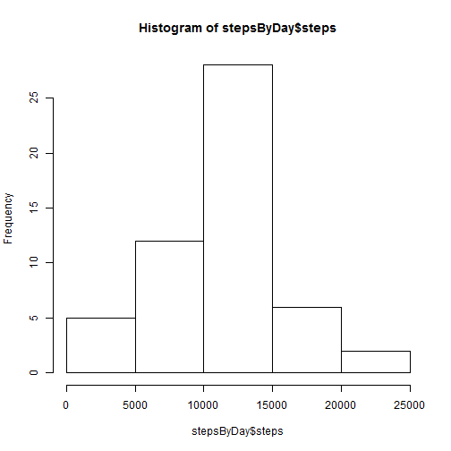
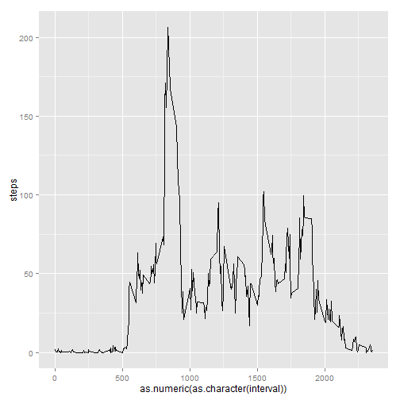
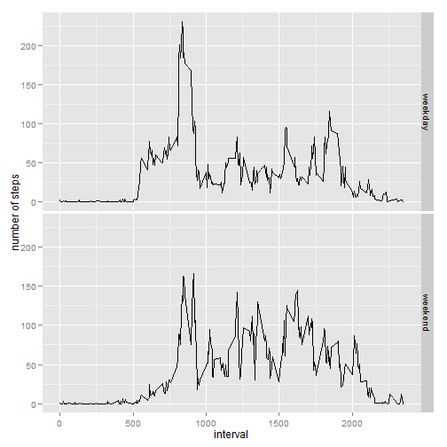

# Reproduceable research project 1
## Jim Smith
========================================================

The activity.csf file was extracted from repdata-data-activity.zip and placed in the working directory.
The variables included in this dataset are:

- steps: Number of steps taking in a 5-minute interval (missing values are coded as NA)
- date: The date on which the measurement was taken in YYYY-MM-DD format
- interval: Identifier for the 5-minute interval in which measurement was taken

The dataset is stored in a comma-separated-value (CSV) file and there are a total of 17,568 observations in this dataset.

```r
activityData = read.csv("activity.csv")
# use date format
activityData$date = as.Date(activityData$date, format = "%Y-%m-%d")
# use factors for interval
activityData$interval <- factor(activityData$interval)
```

Display a histogram of the steps taken each day along with mean and median steps


```r
# use aggregate to get a data frame of sum of steps by date
stepsByDay <- aggregate(steps ~ date, data=activityData, FUN=sum, na.rm=TRUE)
hist(stepsByDay$steps)
```

 

```r
meanSteps = mean(stepsByDay$steps, na.rm=TRUE)
summary(stepsByDay$steps)
```

```
##    Min. 1st Qu.  Median    Mean 3rd Qu.    Max. 
##      41    8840   10800   10800   13300   21200
```
Plot of the average daily activity pattern?

Which 5-minute interval, on average across all the days in the dataset, contains the maximum number of steps?

```r
#install.packages("ggplot2")           #ggplot2 has to be installed once
library(ggplot2)
avgStepsByInterval <- aggregate(steps ~ interval, data=activityData, FUN=mean, na.rm=TRUE)
maxAvgStepsIndex <- which.max(avgStepsByInterval$steps)
avgStepsByInterval$steps[maxAvgStepsIndex]
```

```
## [1] 206.2
```

```r
avgStepsByInterval$interval[maxAvgStepsIndex]
```

```
## [1] 835
## 288 Levels: 0 5 10 15 20 25 30 35 40 45 50 55 100 105 110 115 120 ... 2355
```

```r
# need to convert the factor back to numeric
qplot(as.numeric(as.character(interval)), steps, data=avgStepsByInterval, geom = 'line')
```

 

Count the  missing values, then compute new summary statistics and plot histogram


```r
#number of intervals that have NA
length(activityData$steps[is.na(activityData$steps)])
```

```
## [1] 2304
```

```r
# the is.na creates a true/false vector, true for each NA. 
# $interval returns one of the 288 factor variables at each place their is an NA
# $steps returns an average number of steps based on the factor variable
# finally this is saved back into the original data table
activityData$steps[is.na(activityData$steps)] <- avgStepsByInterval$steps[activityData$interval[is.na(activityData$steps)]]
# replot and calculate means after replacing NAs with averages
stepsByDay <- aggregate(steps ~ date, data=activityData, FUN=sum, na.rm=TRUE)
hist(stepsByDay$steps)
```

 

```r
meanSteps = mean(stepsByDay$steps, na.rm=TRUE)
summary(stepsByDay$steps)
```

```
##    Min. 1st Qu.  Median    Mean 3rd Qu.    Max. 
##      41    9820   10800   10800   12800   21200
```
The above statistics show that the histogram doesn't change very much. The mean and median
shift down a small amount from 10880 to 10770.

Are there differences in activity patterns between weekdays and weekends?


```r
weekends = c("Saturday" , "Sunday")
# adds a column with two factors, weekday and weekend
activityData <- cbind(activityData, ifelse(weekdays(activityData$date) %in% weekends, "weekend", "weekday"))
colnames(activityData)[4] <- "weekdays"
avgWeekdaysInterval <- aggregate(steps ~ interval + weekdays, data = activityData, mean)
qplot(as.numeric(as.character(interval)) , steps, data = avgWeekdaysInterval, 
      facets = weekdays ~ . , geom = 'line', xlab = "interval", ylab = "number of steps")
```

 
